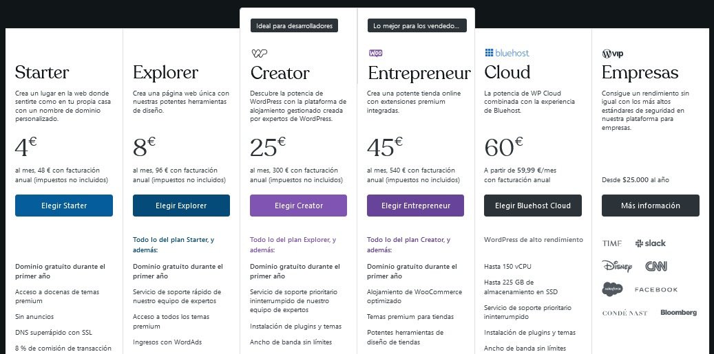
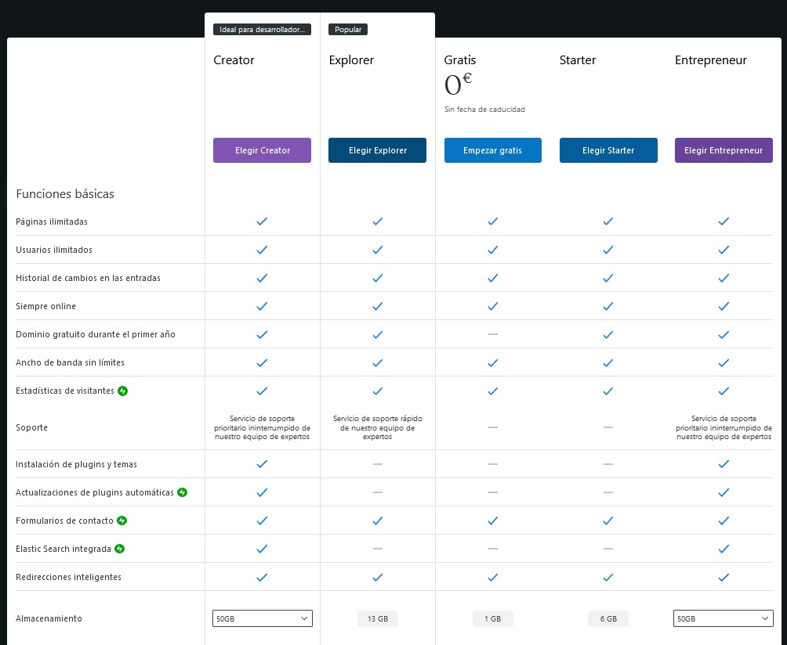
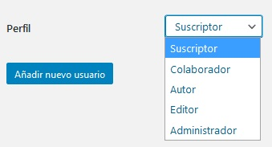
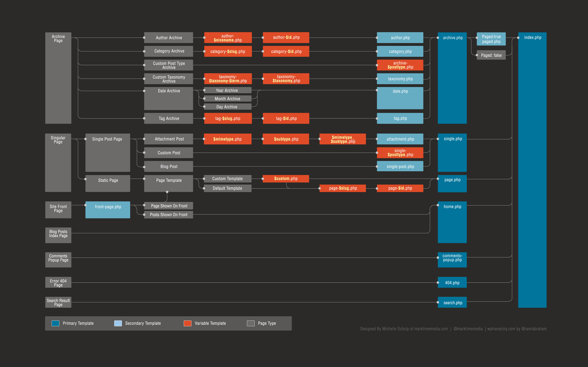
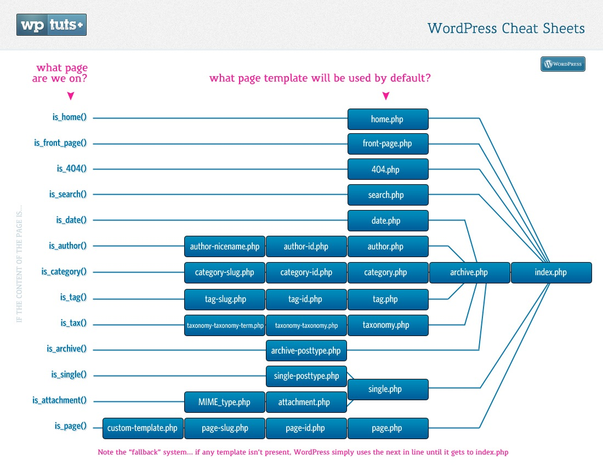
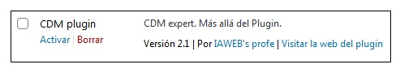
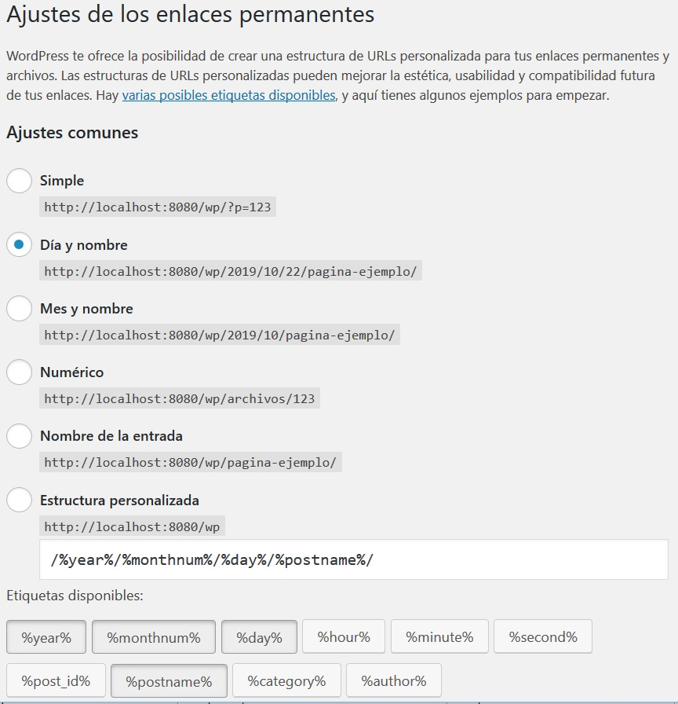
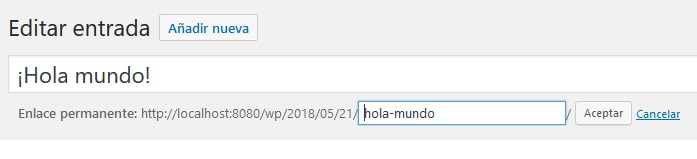

>Wordpress en IAWEB
>Administración de Sistemas Informáticos\
>IES Chan do Monte\
>David L. Amenedo\
>david@edu.xunta.gal


<!-- vscode-markdown-toc -->
1. [Instalación](#Instalacin)
1. [Plantillas](#Plantillas)
1. [Archivos de plantilla](#Archivosdeplantilla)
1. [Creación de un shortcode sencillo](#Creacindeunshortcodesencillo)
1. [Situación del código del shortcode](#Situacindelcdigodelshortcode)
1. [Gestión de los atributos](#Gestindelosatributos)
1. [Función shortcode_atts](#Funcinshortcode_atts)
1. [Gestión del contenido](#Gestindelcontenido)
1. [Devolviendo HTML](#DevolviendoHTML)
1. [Instalación](#Instalacin-1)
1. [Uso de plugins](#Usodeplugins)
1. [Tipos de plugins y ejemplos](#Tiposdepluginsyejemplos)
1. [Creación de plugins](#Creacindeplugins)

<!-- vscode-markdown-toc-config
	numbering=true
	autoSave=true
	/vscode-markdown-toc-config -->
<!-- /vscode-markdown-toc -->

# Introducción

WordPress es un gestor de contenidos (CMS – Content Management System) de código abierto creado para realizar y administrar sitios web.

Al ser de código abierto (licencia GNU GPL – GNU General Public License), quiere decir que cualquiera puede usarlo, copiarlo, estudiarlo, compartirlo y modificarlode cualquier manera. El hecho de ser licencia GPL lo distingue de otras licencias de dominio público en que obliga a protegerlo con copyleft (las copias y derivados tienen que mantener la misma licencia). Es decir, se impide que una licencia libre se “privatice”.

Programado en PHP, comenzó como una herramienta de creación de blogs en 2003.
Datos de 2016 revelaban que de todos los sitios web conocidos que usan un CMS, WordPress representaba casi un 60%, lo cual podría ser cerca de un 30% de toda la web. El propio WordPress pone en su página (Octubre 2020) que es el 38%

Existen dos formas de crear una página web con WordPress:

* [Wordpress.com](https://wordpress.com)

Es una web donde, una vez identificado, te permite crear tu propio sitio web pero con MUCHAS limitaciones (lógicamente, más limitaciones en la versión gratuita). Los [planes](https://wordpress.com/es/pricing/) son los siguientes:



La comparativa de los distintos planes es la siguiente (* Julio 2024)



* [Wordpress.org](https://wordpress.org) ([ es.wordpress.org en español ](https://es.wordpress.org))

Es la web donde podremos bajar una copia del software WordPress, sus plantillas (temas), plugins, así como consultar toda la documentación oficial, participar en foros, etc.

# Instalación

Si elegimos alojar nuestra web en wordpress.com, obviamente ya no necesitamos instalar nada. Únicamente darnos de alta en el plan que mejor se ajuste a nuestras necesidades.
En el caso de contratar alojamiento por nuestra cuenta en otro servidor, podremos:
- ejecutar (desde el panel de control del servidor) uno de los múltiples scripts autoinstalables que habitualmente nos ofrece, para instalar las últimas versiones de las aplicaciones más conocidas.
- bajar de wordpress.org la aplicación y subirla al servidor. Esto se puede hacer a través de un cliente FTP (recomendado) o bien desde un explorador de archivos web que nos ofrezca el panel de control del servidor (subiremos el archivo comprimido eligiendo que se descomprima automáticamente). Iniciaremos la instalación desde el navegador ejecutando su archivo por defecto. En el caso de tener la instalación en local (típicamente durante la fase de desarrollo), posiblemente se iniciará con localhost/carpetaWP

La instalación nos preguntará la información básica necesaria, como por ejemplo:
- datos sobre la base de datos (deberá crearse previamente):
  - nombre de la bd, usuario y contraseña con acceso
  - servidor donde está alojado el gestor de bd
  - prefijo de las tablas (para incrementar seguridad, compartir bds, etc.)
- datos sobre el sitio web:
  - título
  - usuario y contraseña para la administración del sitio web
  - correo electrónico del administrador
- otras opciones:
  * visibilidad de nuestra web por parte de los motores de búsqueda

# Archivos y configuración.

La estructura del WordPress se reduce a tres carpetas y unos cuantos archivos en la carpeta raíz.
- La carpeta **include** contiene el código propio del WordPress
- La carpeta **admin** contiene el panel de control (dashboard) de WordPress
- La carpeta **content** contiene el resto del contenido que le vamos agregando al construir nuestra página como los temas que utilizaremos, los plugins que necesitemos, archivos, etc.

Las carpetas admin e include no se deberían tocar salvo razones justificadas, así como la mayoría de los archivos de la carpeta raíz. Entre ellos el más importante es el que contiene la configuración principal y que se denomina **wp-config.php**. Originalmente se denomina **wp-config-sample.php** y la instalación lo utiliza como plantilla para su creación.

Wordpress busca este archivo en su carpeta raíz y, si no lo encuentra, busca en su carpeta padre (busca en htdocs/mi-sitio-web/wp-config.php y si no lo encuentra busca en htdocs/wp-config.php). Es decir, en el caso de no tener más de una instalación de wordpress en nuestro servidor, es una mejora en la seguridad puesto que eliminamos cualquier posibilidad de acceso a dicho archivo a través del navegador (esto se puede ver en index.php > wp-blog-header.php > wp-load.php)

Dicho archivo incluye varios datos de configuración del wordpress como por ejemplo:

- Acceso a la BD.
>define('DB_NAME', 'wp');\
>define('DB_USER', 'root');\
>define('DB_PASSWORD', '');\
>define('DB_HOST', 'localhost');

- Acceso al proxy del sistema.
>define('WP_PROXY_HOST', '192,168,0,11');\
>define('WP_PROXY_PORT', '3128');

- Codificación y ordenamiento de caracteres.
>define('DB_CHARSET', 'utf8mb4');\
>define('DB_COLLATE', '');

- Claves y sales de autentificación.
Puedes cambiar las claves en cualquier momento para invalidar todas las cookies existentes. Esto forzará a todos los usuarios a volver a hacer login.

>define('AUTH_KEY', 'Tj.}-kl<U5(20........Kv3Fb');\
>define('SECURE_AUTH_KEY', 'eg*6V2R1}....qA2vp');\
>define('LOGGED_IN_KEY', 'smH8332=L7bx...kA5i');\
>define('NONCE_KEY', '!y o`|X(@2s@{RaAN3B...M=}2_&');\
>define('AUTH_SALT', '<u[ge^RQt{D{``:m6_....?CJ3.,9Uf');\
>define('SECURE_AUTH_SALT', 'hsvZaZao>M...=C*T}j0j9|m');\
>define('LOGGED_IN_SALT', 'el?q-/-9s...Ih$-A*U<ez#');\
>define('NONCE_SALT', 'ji)y^np0K....}Jg;Bh1ke)!7SOz6');

- Prefijo de las tablas.  
Permite especificar otro prefijo para las tablas para dar seguridad, además de permitir instalar más de un wordpress en una única base de datos
>$table_prefix  = 'wp_';

- Modo depuración para desarrolladores
Si está a true mostrará errores en pantalla. Debe estar a true durante el desarrollo y siempre a false en producción.
>define('WP_DEBUG', false);

# Contenido

Existen tres tipos principales de contenido en WordPress:
- Posts (entradas, artículos). Contenido generado puntual o periódicamente para informar de algo, puede ser comentado si se quiere. Pueden categorizarse y etiquetarse.
- Pages (páginas). Contenido estático que no suele cambiar generalmente como la página principal, página de contacto, acerca de, etc.
- Media. Contenido no textual como imágenes, videos, etc. que pueden ser visualizados en las páginas o en las entradas. 

WordPress almacena toda la información de sus entradas y sus páginas en la base de datos, pero almacena los archivos subidos en la carpeta **wp-content/uploads**, organizados en subcarpetas basadas en el mes y el año en que fueron subidos.

# Usuarios

Para crear usuarios tenemos una entrada en el menú principal del Escritorio. Seleccionando Usuarios > Añadir nuevo podremos insertar nuevos usuarios donde se especificará, al menos, el nombre del usuario, la contraseña y su perfil.



# Roles (perfiles):

- SuperAdministrador: administrador para Wordpress multisite 
- Administrador: acceso a todas las capacidades
- Editor: publica y edita entradas propias y de otros usuarios, modera comentarios y crea categorías.
- Autor: publica y edita sus propias entradas
- Colaborador: escribe y edita sus propias entradas, pero no las publica (necesita revisión y aprobación)
- Suscriptor: sólo puede leer entradas y páginas, además de editar su propio perfil. Puede ser interesante para controlar la lectura de ciertos contenidos al no ser visitantes anónimos.

# Capacidades (permisos): 

Escribir y editar entradas, crear páginas, crear enlaces, crear categorías, moderar comentarios, administrar plugins, administrar temas y administrar usuarios
	
En General > Settings podemos especificar, entre otros muchos parámetros:

- Membership (Anyone can register) - Especifica si cualquiera puede crear una cuenta en el sitio web
- New User Default Role: selecciona el Rol por defecto asignado a los nuevos usuarios en la opción Usuarios (Administrator, Editor, Author, Contributor, or Subscriber)

Si queremos afinar más existen multitud de plugins para ello, o bien programando las funciones add_role(), remove_role(), get_role(), add_cap(), remove_cap() y add_cap()

La función get_role($role) devuelve un objeto WP_Role (wp-includes/capabilities.php). 


Por ejemplo, get_role('Administrator') devuelve un WP_Role Object:
```json
{
  "name": "administrator",
  "capabilities" =>
  {
	"switch_themes": 1,"edit_themes": 1,"activate_plugins": 1,
	"edit_plugins": 1,"edit_users": 1,"edit_files": 1,
	"manage_options": 1,"moderate_comments": 1,"manage_categories": 1,
	"manage_links": 1,"upload_files": 1,"import": 1,
	"unfiltered_html": 1,"edit_posts": 1,"edit_others_posts": 1,
	"edit_published_posts": 1,"publish_posts": 1,"edit_pages": 1,
	"read": 1,	"level_10": 1,"level_9": 1,"level_8": 1,
	"level_7": 1,"level_6": 1,"level_5": 1,"level_4": 1,
	"level_3": 1,"level_2": 1,"level_1": 1,"level_0": 1,
	"edit_others_pages": 1,	"edit_published_pages": 1,"publish_pages": 1,
	"delete_pages": 1,"delete_others_pages": 1,"delete_published_pages": 1,
	"delete_posts": 1,"delete_others_posts": 1,"delete_published_posts": 1,
	"delete_private_posts": 1,"edit_private_posts": 1,"read_private_posts": 1,
	"delete_private_pages": 1,"edit_private_pages": 1,"read_private_pages": 1,
	"delete_users": 1,"create_users": 1,"unfiltered_upload": 1,
	"edit_dashboard": 1,"update_plugins": 1,"delete_plugins": 1,
	"install_plugins": 1,"update_themes": 1,"install_themes": 1,
	"update_core": 1,"list_users": 1,"remove_users": 1,
	"add_users": 1,"promote_users": 1,"edit_theme_options": 1,
	"delete_themes": 1,"export": 1,"edit_comment": 1,
	"approve_comment": 1,"unapprove_comment": 1,"reply_comment": 1,
	"quick_edit_comment": 1,"spam_comment": 1,"unspam_comment": 1,
	"trash_comment": 1,"untrash_comment": 1,"delete_comment": 1,"edit_permalink": 1
  }
}
```

# Temas

Un tema es un conjunto de archivos (llamados archivos de plantilla) que producen un interfaz web para visualizar el contenido alojado en la base de datos del WordPress. Cambiando el tema se cambia la estructura, estilos y visualización general del sitio.

##  1. <a name='Instalacin'></a>Instalación

- Automáticamente desde el Dashboard en Apariencia > Temas
- Bajando el tema manualmente y descomprimiéndolo en wp-content/themes

En https://wordpress.com/themes podemos consultar con distintos filtros los temas existentes en el directorio de temas de WordPress. Podemos obtener los temas en dicho directorio o en cualquier otros sitio (la web de su creador, p.e.), aunque hay que tener cuidado porque el código que bajamos en un tema podría contener código malicioso.

Información sobre desarrollo de temas:  https://developer.wordpress.org/themes/getting-started

##  2. <a name='Plantillas'></a>Plantillas

Son los archivos PHP usados para generar el HTML de las páginas solicitadas. Básicamente se componen de HTML, PHP y llamadas a las funciones de plantilla de Wordpress.

Se pueden definir plantillas para las distintas características del sitio web aunque no es necesario crear todas las posibles para que la web funcione. 

Cada vez que wordpress recibe una petición y necesita visualizar un contenido, busca la plantilla del tema actual que más se ajusta. Para ello existe una **jerarquía de archivos de plantilla**, buscando siempre en la más específica para acabar en la más general, que es el index.php del tema.

Por ejemplo, si se realiza una petición a una página de una categoría como por ejemplo

http://miSitioWordpress.com/category/una-cierta-categoria

Wordpress buscará la plantilla adecuada en el la carpeta del tema actual, de la siguiente manera:

1. Busca el archivo category-$slug.php  donde $slug es el de la categoría una-cierta-categoria
1. Si no lo encuentra, buscará el archivo category-$idCategoria
1. Si no lo encuentra, buscará el archivo category.php
1. Si no lo encuentra, buscará el archivo archive.php
1. Finalmente, si no lo encuentra, procesará el archivo index.php

En la siguiente imagen se pueden visualizar las plantillas que busca y en qué órden.





##  3. <a name='Archivosdeplantilla'></a>Archivos de plantilla

###  3.1. <a name='style.css'></a>style.css
La hoja de estilos principal, de obligatoria existencia en un tema.
###  3.2. <a name='rtl.css'></a>rtl.css
La hoja de estilos rtl (right-to-left), si el texto de la web va en esa dirección.
###  3.3. <a name='index.php'></a>index.php
La plantilla principal, de obligatoria existencia si el tema proporciona sus propias plantillas, puesto que es la que usará si no encuentra ninguna más específica.
###  3.4. <a name='comments.php'></a>comments.php
La plantilla para los comentarios.
###  3.5. <a name='front-page.php'></a>front-page.php
La plantilla de la página principal de nuestro sitio web.
###  3.6. <a name='home.php'></a>home.php
La plantilla de la página inicial por defecto. Si se usa una página estática como página inicial, esta es la plantilla para la página que contendrá los últimos posts. Es decir, esta es la página principal de la sección de blog, donde se muestran los posts. Se usa si no existe front-page.php. Estas dos plantillas se usan en función de lo que elijamos en Settings>Reading>Front page displays.
###  3.7. <a name='single.php'></a>single.php
La plantilla usada cuando se pide un único post.  Si no existe se usa index.php.
###  3.8. <a name='single-post-type.php'></a>single-{post-type}.php
Usada cuando se pide un único post de un cierto tipo. Se pueden crear tipos personalizados (además de los existentes: post, page, attachment, etc.) Por ejemplo, single-libro.php se usará para mostrar los posts con el tipo personalizado llamado “libro”. Si no existe el archivo, se usa index.php
###  3.9. <a name='page.php'></a>page.php
La plantilla usada cuando se pide una página individual.

###  3.10. <a name='category.php'></a>category.php
La plantilla usada cuando se pide una categoría.
###  3.11. <a name='tag.php'></a>tag.php
La plantilla usada cuando se pide una etiqueta.
###  3.12. <a name='taxonomy.php'></a>taxonomy.php
La plantilla usada si se pide un término en una taxonomía personalizada. Además de las tres taxonomías predefinidas (categorías, etiquetas y categorías de links) podemos crear nuevas taxonomías para agrupar de una nueva manera los elementos de wordpress.
###  3.13. <a name='author.php'></a>author.php
La plantilla usada cuando se pide un autor.
###  3.14. <a name='date.php'></a>date.php
La plantilla usada cuando se pide una fecha o una hora (año, mes, día, hora, minuto o segundo).
###  3.15. <a name='archive.php'></a>archive.php
La plantilla usada cuando se pide una categoría, autor o fecha, salvo que sea sobreescrita por las plantillas correspondientes, anteriormente citadas.
###  3.16. <a name='search.php'></a>search.php
La plantilla usada cuando se muestran los resultados de una búsqueda.
###  3.17. <a name='attachment.php'></a>attachment.php
La plantilla usada cuando se visualiza un adjunto.
###  3.18. <a name='image.php'></a>image.php
La plantilla usada cuando se visualiza una imagen adjunta. Si no existe esta plantilla, se usará attachment.php. 
###  3.19. <a name='php'></a>404.php
La plantilla usada cuando Wordpress no encuentra un post o una página que encaje con la petición realizada.

# El bucle (the loop)

En WordPress se denomina el bucle (the loop) al código usado para procesar y/o mostrar información de distintas entradas (posts). Se utiliza en casi cualquier archivo de plantilla que muestre distintas entradas, como las entradas de una cierta categoría, publicadas por un autor, etc.

El siguiente archivo de plantilla (bucle mínimo) mostrará el contenido (únicamente) de cada artículo.
```php
<?php
get_header();
if (have_posts()) :
   while (have_posts()) :
      the_post();
      the_content();
   endwhile;
endif;
get_sidebar();
get_footer(); 
?>
```

La función have_posts() comprueba si existen entradas que cumplan los criterios devolviendo  true/false para el correcto funcionamiento del bucle.

Las sucesivas llamadas a la función the_post() van recuperando, una a una, la información de cada post almacenado en la base de datos. Dicha información se almacena en el objeto global $post. Dicho objeto es una ocurrencia de la clase WP_Post: a continuación podemos ver algunos de sus campos:

```php
final class WP_Post {
 	public $ID;
	public $post_author = 0;
	public $post_date = '0000-00-00 00:00:00';
	public $post_date_gmt = '0000-00-00 00:00:00';
 	public $post_content = '';
 	public $post_title = '';
 	public $post_excerpt = '';
 	public $post_status = 'publish';
 	public $comment_status = 'open';
	public $post_modified = '0000-00-00 00:00:00';
	public $post_modified_gmt = '0000-00-00 00:00:00';
 	public $comment_count = 0;
	… 
}
```
Dicha variable $post puede ser consultada directamente (utilizando el operador $objeto→campo), o bien podemos utilizar las funciones de plantilla (que generalmente sólo se deben utilizar en el interior del bucle):

```php
- the_title()
- the_content()
- the_excerpt()
- the_date()
- the_time()
- the_author()
- the_category()
- the_permalink()
- the_tags()
- // etc.
```
La llamada a estas funciones **visualiza** (hace un echo) del dato correspondiente.

Por ejemplo, podemos incluir este bucle en una plantilla para visualizar ciertos datos de un post.

```php
<?php
if ( have_posts() ) :
   while ( have_posts() ) :
	the_post(); 
?>
	<h1><?php the_title(); ?></h1>
	<hr>
	<?php
	if ( has_excerpt() )
		the_excerpt();
	else
		the_content();
	?>
	<hr>
	Creado por <?php the_author()?> el <?php the_date()?>  a las <?php the_time()?> 

<?php 
   endwhile;
endif;
?>
```

Pero algunas de estas funciones hacen referencia a varios datos (un post puede tener varias categorías o varias etiquetas…). En este caso se le puede pasar un primer parámetro que será el separador utilizado para visualizarlo (lista desordenada por defecto).

Existen otras funciones complementarias, muchas comienzan con get_ (get_the_author(), get_the_title(), get_the_excerpt(), get_the_category(), get_the_tags(), etc.) que se pueden llamar en cualquier momento dentro del bucle para obtener (no visualizar) el dato necesario del post actual. 

A dichas funciones también se las puede llamar pasándoles el ID de un post determinado para obtener su dato.

De nuevo comentar que es posible que algunas de las funciones anteriores en vez de de devolver un dato primitivo como una cadena (get_the_title()), puede ser que devuelva un array de objetos. Tal es el caso de get_the_category() o get_the_tags(), que devuelven un array de objetos de tipo **WP_Term** (que disponen de, entre otros, los campos term_id y name)

# Temas hijos
	
La creación de temas hijos es muy interesante para los desarrolladores, debido a que de esta manera heredamos la funcionalidad de otro tema, pudiéndo añadir o modificar lo que necesitamos. La actualización del tema padre no afectará a nuestro tema, pues cada uno se encuentra en su propia carpeta.

Para crear un tema hijo, haremos lo siguiente:

1. Creamos una carpeta para nuestro tema en wp-content/themes
1. Necesitamos crear  un archivo denominado style.css (es el único archivo de obligatoria creación), con la siguiente sintaxis:
   
    ```php      
    /*
    Theme Name:   Mi tema hijo
    Theme URI:    http://empresa.com/mi-tema-hijo/
    Description:  Tema principal de la empresa, heredando de Twenty Fifteen
    Author:       Pepe Diseñador
    Author URI:   http://pepe.empresa.com
    Template:     twentyfifteen
    Version:      1.0.0
    Tags:         two-columns, left-sidebar, responsive-layout, yellow
    */

    @import url("../twentyfifteen/style.css");

    /* Aquí empieza la personalización de tu tema */
    ```

1. En Theme Name pondremos el nombre de nuestro tema
1. En Template pondremos exactamente el nombre de la carpeta del tema padre
1. La línea @import nos permite importar el archivo de estilo del tema padre
1. A continuación personalizaremos lo que queramos (de style.css)
1. Crearemos en la carpeta de nuestro tema tantos archivos PHP como queramos sustituir del padre (header.php, footer.php, etc. – obviamente en la misma ruta relativa que en el padre), o archivos más específicos como por ejemplo plantillas que el padre no haya creado y sí le interese al tema hijo.
1. A diferencia de lo comentado en el punto anterior, el archivo **functions.php** sí que se puede crear en ámbos temas y no se sobreescriben, sino que se carga primero el del hijo y luego el del padre, por lo que meteremos justo lo necesario en el functions.php del hijo – fijarse que los temas suelen estar bien programados y no suelen definir una función susceptible de ser sobreescrita sin comprobar antes si ya ha sido definida, utilizando la sintaxis if ( ! function_exists( 'nombreDeFunción' ) )
1. Finalmente le podremos asignar una imagen, un archivo denominado **screenshot.png** que situaremos en la carpeta raíz del tema. El tamaño que nos recomiendan utilizar es 880x660.

Y como siempre, existen plugins para realizar todo esto sin tocar nada de código: Child Theme Configurator, por ejemplo.


# Shortcodes

Un shortcode es una macro que llamamos habitualmente desde el contenido de un post, y que ejecuta una función cuyo resultado devuelto se integra en el contenido de dicho post.

Desde el editor se introduce un bloque de tipo shortcode y se escribe [nombre_del_shortcode].
Su sintaxis es muy similar a los elementos HTML, pero cambiando las <> por []. 
De hecho, opcionalmente, pueden tener atributos y contenido.

``` 
[nombreSC attr1='valor1' attr2='valor2']
	contenido
[/nombreSC]
```

Si en vez de querer que se visualice directamente, queremos obtener el resultado del shortcode desde código php para su tratamiento, se puede acceder llamando a la función **do_shortcode**, que recibe como parámetro una cadena con la llamada al shortcode que queremos ejecutar y sus posibles parámetros, corchetes incluídos.
```php
$resultado=do_shortcode('[nombre_del_shortcode ... ]')
```

##  4. <a name='Creacindeunshortcodesencillo'></a>Creación de un shortcode sencillo

El código necesario para crear un shortcode consiste en:
- crear la función que va a devolver el contenido HTML que visualiza el shortocde
- informar a wordpress de la creación de nuestro shortcode a través de la función add_shortcode, pasándole como parámetros el nombre de nuestro shortcode (no puede repetirse), y la función asociada.

``` php
function sc_func( $atts ) {
  return 'Texto a visualizar' ;
}
add_shortcode( 'sc', 'sc_func' );
```

##  5. <a name='Situacindelcdigodelshortcode'></a>Situación del código del shortcode

- Directamente en el functions.php del tema. Muy mala idea, entre otras cosas porque una actualización del tema borraría el código, o si cambio de tema habría que mover el código.
- Incluirlo/requerirlo en el archivo anterior. Algo mejora, pero de nuevo una actualización nos obligaría a reescribir los requires/includes.
- Usar temas hijos. Una buena solución, pues heredamos toda la funcionalidad de un tema existente, añadiendo o modificando lo que creamos conveniente en un tema separado. Obviamente la actualización del padre no afecta al tema hijo. Su creación está explicada en un epígrafe anterior.
- Usar algún plugin existente como contenedor de código, activando y desactivando cuando sea necesario.
- Crear nosotros mismos un plugin con el código del shortcode y activarlo

``` php
<?php
/*
Plugin Name: Short Code Container
Plugin URI: http://shortcodecontainer.com/
Description: Contenedor de mis shortcodes más habituales
Version: 1.0
Author: David
Author URI: http://david.es
License: GPLv2
*/

function f($atts) { 
	return "Mi nuevo shortcode"; 
}
add_shortcode("sc","f");
?>
```

##  6. <a name='Gestindelosatributos'></a>Gestión de los atributos

La llamada al shortcode se realiza habitualmente escribiendo en una página o en un post el comando adecuado entre corchetes. En el caso de espeficiar atributos  [sc atributo1='valor1'  atributo2=valor2 ...] éstos se recogerán en el código de la función accediendo a su primer parámetro.

Es importante entender que la existencia de los atributos depende del usuario que postea, por lo que nunca se puede asumir su existencia o la validez del valor especificado.

``` php
function sc_func( $atts ) {
  // accedemos a $atts['atributo1'], $atts['atributo2'], … (pueden no exitir)

  return “el HTML generado por el shortcode” ;
}

add_shortcode( 'sc', 'sc_func' );
```

Cuando se encuentra un shortcode en la página o en el post, se llama a la función asociada, pasándole como primer parámetro un array asociativo creado con los atributos indicados en la llamada a dicho shortcode. En la creación de dicho array ($atts) los nombres de los atributos, futuras claves en dicho array, se pasan a minúscula.

Por ello, el código PHP de la función deberá trabajar con los valores en minúscula, dando así libertad al usuario que utilice el shortcode a que no tenga que preocuparse del *ignore case* en los nombres de los atributos. Obviamente, los valores no se modifican.

##  7. <a name='Funcinshortcode_atts'></a>Función shortcode_atts

Para agilizar la gestión de atributos por parte de un shortcode, WordPress pone a nuestra disposición la función shortcode_atts. Su uso es opcional, pero puede ser interesante, sobre todo cuando hay muchos parámetros y queremos gestionar sus valores por defecto cuando éstos no se especifican en la llamada al shortcode.

>NOTA: La llegada con PHP 7 del operador **?? fusión de null/coalesce operator** hizo posible un código PHP más sencillo y limpio, por lo que podría suponer una alternativa al uso de esta función.

 En su primer parámetro, nos permite especificar en un array asociativo tantas claves como atributos necesita nuestro código, junto con sus valores por defecto. El segundo parámetro será directamente el atributo $atts, es decir, el mismo array asociativo que WordPress nos pasa con los pares atributo-valor que el usuario a especificado al llamar al shortcode.

La función shortcode_atts nos devuelve un nuevo array asociativo creado a partir de la estructura del array pasado como primer parámetro, y cuyos valores serán los de $atts si existen, y los valores por defecto en caso contrario.

``` php
<?php
function sc_func( $atts ) {
  $out = shortcode_atts(
	  array('atributo1' => valorPorDefecto1,
		'atributo2' => valorPorDefecto2),
		...
	  $atts);
  // accedemos a $out['atributo...'], no a $atts
  return ... ;
}
add_shortcode( 'sc', 'sc_func' );
```

La función shortcode_atts se encuentra en el archivo shortcodes.php de la carpeta wp-includes.

##  8. <a name='Gestindelcontenido'></a>Gestión del contenido

Como ya vimos anteriormente, debe llamarse al shortcode con contenido, abriendo y cerrando de forma similar al HTML:
[sc ... ]contenido[/sc]

El contenido se recoge en el segundo parámetro de la función asociada al shortcode. Se le puede poner un valor por defecto para detectar cuando no se ha especificado contenido en el uso del shortcode.

```php
function sc_func($atts, $contenido='') {
	…
	if($contenido=='')
		return "No hay contenido";
	else	
		return "El contenido es $contenido";
}
add_shortcode( 'sc', 'sc_func');
```

##  9. <a name='DevolviendoHTML'></a>Devolviendo HTML

La devolución de un gran contenido de texto HTML por parte de la función del shortcode puede producir un código complicado de mantener.

Crear una variable de texto donde vamos concatenando el HTML necesario no permite la separación deseada entre código e interfaz.

Para solucionar este problema lo mejor es cortar el PHP de la función e incluir el HTML como texto de manera que el editor utilizado nos pueda reconocer su sintaxis y ayudarnos en su edición.

Pero como al texto no hay que darle salida (echo) sino devolverlo (return), las dos mejores opciones serían utilizar **heredoc** y utilizar **output buffering**:

- Con heredoc:
``` php
function sc_func( $args ) {
… 
return  <<<FIN
<!-- aquí el contenido HTML con $variables que se evaluarán como con comillas dobles --> 
FIN;
}
```

- Con output buffering:
``` php
function sc_func( $args ) {
  … 
  ob_start();
?> 
<!-- aquí el contenido HTML (o require y situarlo en archivo aparte ) --> 
<?php
  return ob_get_clean();
}
```

# Plugins
	
##  10. <a name='Instalacin-1'></a>Instalación 
	
La instalación se puede realizar desde el Dashboard del propio Wordpress, desde la opción Plugins, o bien realizando una instalación manual de la siguiente forma:

• Buscar y bajar desde https://wordpress.org/plugins/ o página del desarrollador.
• Descomprimir en wp-content/plugins

##  11. <a name='Usodeplugins'></a>Uso de plugins

El acceso a la configuración y uso de los plugins se hace desde la sección adecuada del Dashboard.
Por ejemplo, plugins para gestionar la seguridad del sitio, crear backups o chequear si existen enlaces rotos en nuestro sitio web.

Pero existen otros plugins que tiene sentido insertarlo en una página o post concreto: p.e., los que crean formularios para entrada de datos de los usuarios, los que crean un slider con diapositivas, etc.
Este tipo de plugins solemos utilizarlos a través de shortcodes creados por el propio plugin, así que habrá que acudir a su documentación para ver qué parámetros tienen y cómo se usan.

##  12. <a name='Tiposdepluginsyejemplos'></a>Tipos de plugins y ejemplos

- Seguridad: bulletproof, bettersecurity, Wordfence Security
- Evitar spam en comentarios: akismet
- Mejorar editor de páginas/post: TinyMCE Advanced
- Mejorar cache: WP Super Cache, W3 Total Cache
- Formularios de contacto: Contact Form 7
- Importar elementos (páginas, post, comentarios, categorías, etc.) de una exportación de WP
- Comercio electrónico: WooCommerce
- SEO (Search Engine Optimizacion): All in One SEO Pack, SEO Ultimate
- Backups: Duplicator,  BackWPup, BackUpWordPress
- Publicar código fuente: WP-Syntax (usa GeSHi - Generic Syntax Highlighter)
- Enlaces: Broken Link Checker
- Gestores de entradas:  Sticky post, cambios de fechas, PostExpirator (contenido puntual, oferta del día), y al “caducar” se mueva a borradores, se elimina o se pasa a alguna categoría especial.
- Calendarios, gestores de imágenes, sliders, captchas, estadísticas del sitio web, etc.

##  13. <a name='Creacindeplugins'></a>Creación de plugins 

https://developer.wordpress.org/plugins/ 

Se crea una subcarpeta en wp-content/plugins con el archivo php principal del plugin y los archivos auxiliares necesarios. El archivo principal será aquel que tenga la siguiente cabecera:

```php
<?php
/*
Plugin Name: CDM plugin      (* único obligatorio)
Plugin URI:  
Description: CDM++ expert. Más allá del Plugin.
Version: 2.1
Author: IAWEB’s profe
Author URI: 
License: GPLv2 or later
*/

// código del plugin

?>
```

Si el archivo consta únicamente de un archivo PHP se puede almacenar directamente en wp-content/plugins, pero esto no es muy habitual. De hecho, la recomendación es utilizar una estructura similar a la siguiente:

```
/my-plugin-name
     my-plugin-name.php
     uninstall.php
     /admin
     /js
     /css
     /images
     /includes
     /settings
```

También es importante prefijar las variables con el nombre o acrónimo del plugin para evitar colisiones con variables y/o funciones declaradas en otros plugins.

Los plugins pueden activarse o desactivarse cuando se desee desde la sección Plugins del Dashboard.



En el caso de querer un plugin siempre activado (Must-use plugin) podríamos almacenarlo en la carpeta especial wp-content/mu-plugins. Este plugin no aparecería en la sección de plugins habitual, y la única manera de desactivarlo sería eliminarlo de dicha carpeta (no recomendado).

Se puede consultar un manual de buenas prácticas de programación de plugins en https://developer.wordpress.org/plugins/the-basics/best-practices/


# SLUG

Slug es el texto amigable que se usa después del dominio en la URL de un sitio web Wordpress. Utilizar un slug que se entienda y tenga las palabras clave importantes del artículo, hará que nuestro sitio se indexe mejor por parte de los motores de los buscadores, mejorando de esta manera el posicionamiento (SEO).

Por defecto, wordpress accede, por ejemplo a un post, con la dirección http://dominioSitioWordpress/?p=id lo cual no dice mucho de su contenido, y no se indexa bien.

En Ajustes > Enlaces permanentes (permalinks) podemos cambiarlo y personalizarlo. Así podemos tener una URL amigable con un slug que se nos crea automáticamente, por ejemplo, del título, y suele ser un texto que cumple la expresión regular [a-z\d\-]+



Tienen slug las entradas, las páginas, las categorías y las etiquetas.

En el dashboard, tanto para entradas como para páginas, podemos mostrarlo y modificarlo en una sección que podemos activar en Opciones de pantalla > Mostrar SLUG, aunque se edita directamente en "Enlace Permanente" de la propia entrada o página.



Como vemos, en el caso de definir un enlace permanente, el slug editable será la última parte donde suele ser interesante cambiar, por ejemplo, un título muy largo en uno más corto con las palabras adecuadas.

# Seguridad

Algunos consejos generales para asegurar nuestra instalación de Wordpress pueden ser:

- Actualizar el CMS (manual o automáticamente si lo permite)
- Instalar/actualizar plugins de seguridad (generar .htaccess)
- Contraseñas seguras
- Cambiar prefijos de la BD
- Cambiar/eliminar carpetas estándar
- Restringir los permisos de archivos y carpetas
- Ocultar la versión
- No usar admin como usuario de administración. Si ya está creado, crear otro usuario con perfil de Administrador, autentificarse con éste, borrar Admin chequeando la casilla de verificación para asignar todo el contenido publicado al nuevo.
